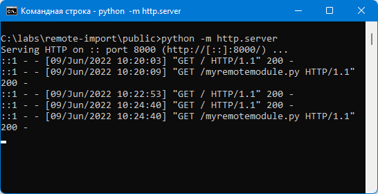
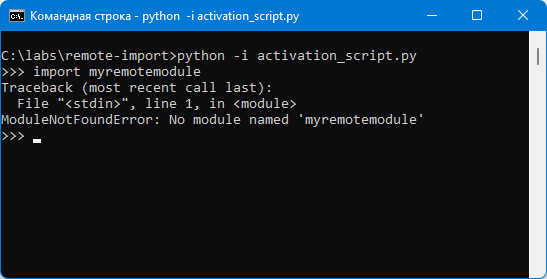
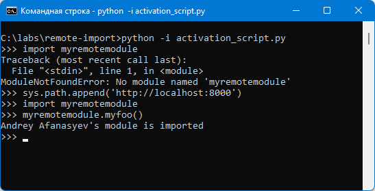
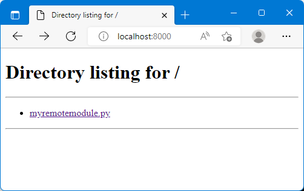
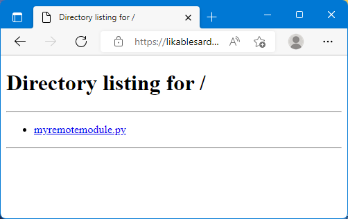
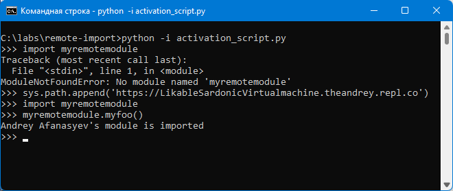

# Лабораторная работа 3

Запуск сервера:

Импорт модуля:

Вид страницы в браузере:

Чтобы импортировать модуль, нужно, чтобы его название с расширением .py содержалось в тексте страницы.

**Использование стороннего сервера (Replit):**

